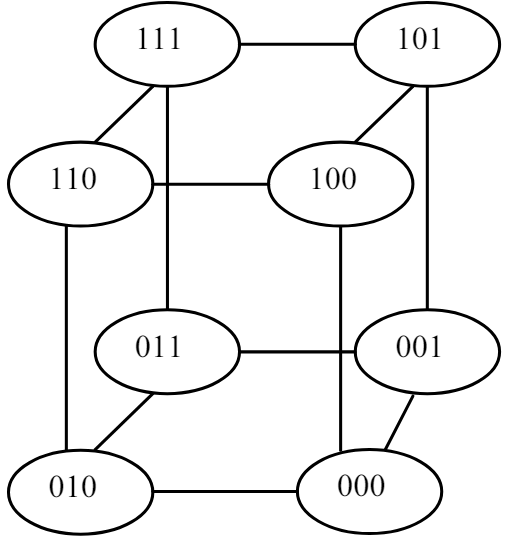
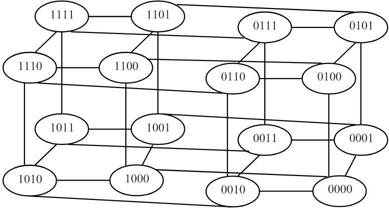
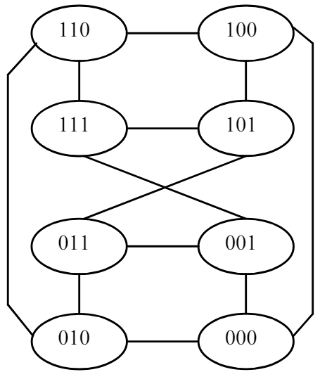
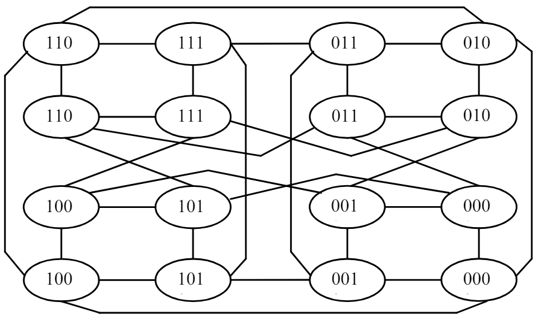

# 问题描述

量子随机行走是经典随机行走的量子版，它在多边形上的应用包括图论、搜索算法和物理模拟等。量子随机行走利用量子叠加和干涉的特性，可以在某些问题上表现出比经典算法更优的性能。

在一个 $n$ 边形中，定义量子随机行走如下：
- 每个顶点用一个量子态表示，记作 $|v_i\rangle$，其中 $i \in \{1, 2, \ldots, n\}$。
- 量子行走者可以在相邻的顶点之间移动，通过应用一个单位ary操作来实现。

量子行走者的状态可以表示为这些顶点态的线性叠加：
$$
|\psi\rangle = \sum_{i=1}^n \alpha_i |v_i\rangle
$$
其中 $\alpha_i$ 是对应顶点 $|v_i\rangle$ 的概率幅。

# 算法流程

## 量子线路

1. **初始化**：将量子行走者初始化在某个顶点，例如顶点 $|v_1\rangle$。
2. **Hadamard 门**：应用 Hadamard 门到初始状态，产生顶点的均匀叠加态：
$$
|\psi\rangle = \frac{1}{\sqrt{n}} \sum_{i=1}^n |v_i\rangle
$$
3. **时间演化**：根据多边形的边结构，应用单位ary操作 $U$，该操作在每个时间步长将量子态从一个顶点移到相邻的顶点上。
4. **测量**：经过若干次时间步长后，测量量子行走者的状态，得到它在各个顶点的概率分布。

## 数学描述

量子行走的单位ary操作可以表示为 $U$，作用在量子态 $|\psi\rangle$ 上，使得：
$$
|\psi(t+1)\rangle = U |\psi(t)\rangle
$$
通过迭代应用 $U$，可以模拟量子行走者在多边形上的移动。

# 立方体(cube)上的量子随机游走

- **超立方体**  (Hypercube)
超立方体是一种规则图[^3]，其顶点表示为n位二进制数，每个顶点之间的边表示它们之间只有一个位不同。一个n维的超立方体由 $2^n$ 个顶点组成，直径为n。比如，三维超立方体（HQ3）有8个顶点，直径为3；

四维超立方体（HQ4）有16个顶点，直径为4。超立方体结构通常用于并行计算和通信网络中，因为它具有良好的对称性和可扩展性。

- **交叉立方体** (Crossed Cube)
交叉立方体也是一种规则图，它是通过对超立方体的某些边进行交换来构造的。n维交叉立方体的顶点数与超立方体相同，但直径是超立方体的一半。例如，三维交叉立方体（CQ3）有8个顶点，直径为2；

四维交叉立方体（CQ4）有16个顶点，直径为3。

交叉立方体的这种较小直径使其在路径长度和通信效率上具有优势。

# 参考文献
1. [Efficient quantum circuit implementation of quantum walks](https://arxiv.org/pdf/0706.0304)
2. [Quantum Walks for Crossed Cubes](https://ieeexplore.ieee.org/document/6721063)

[^3]: 规则图 (Regular Graph)
